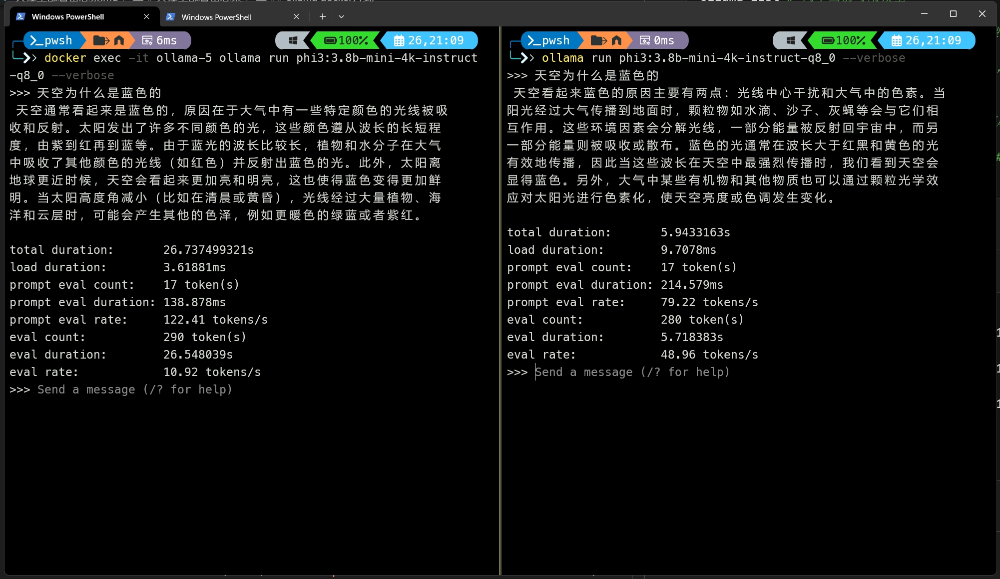
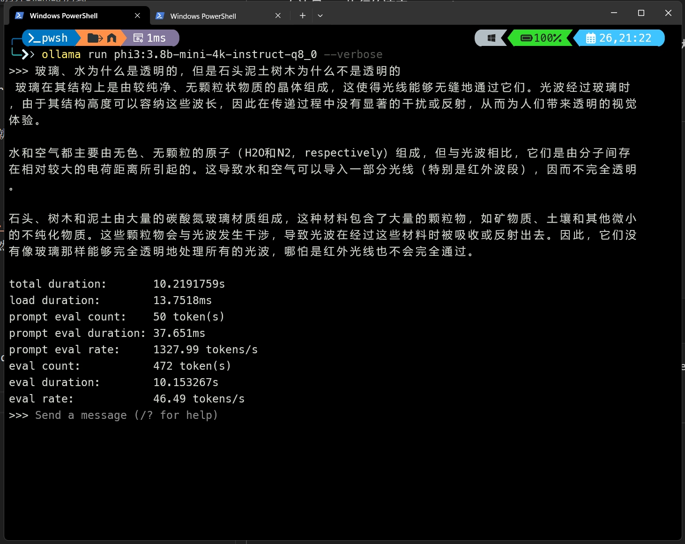
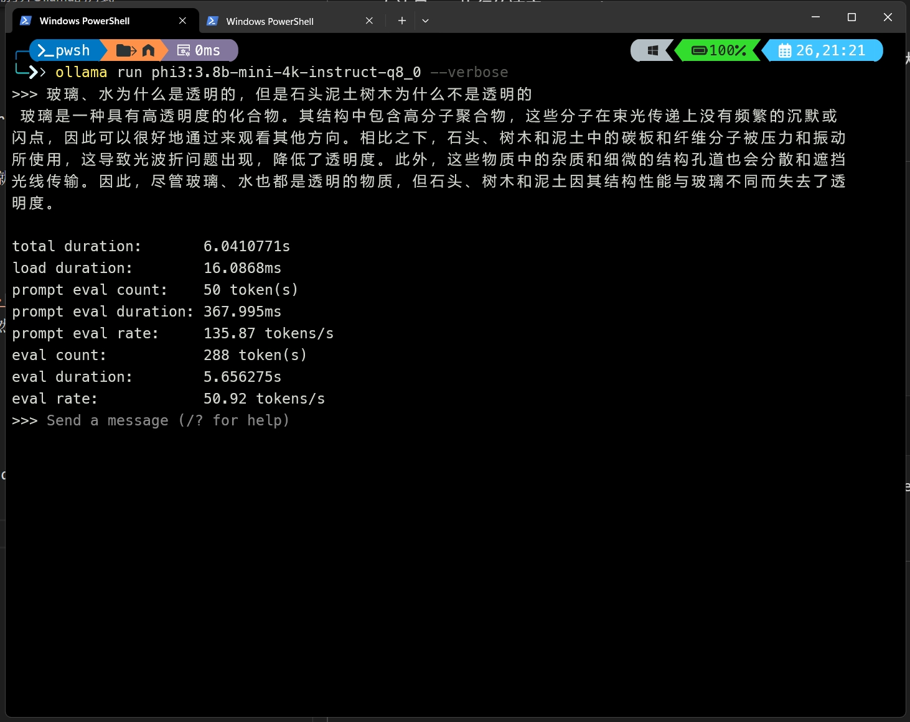
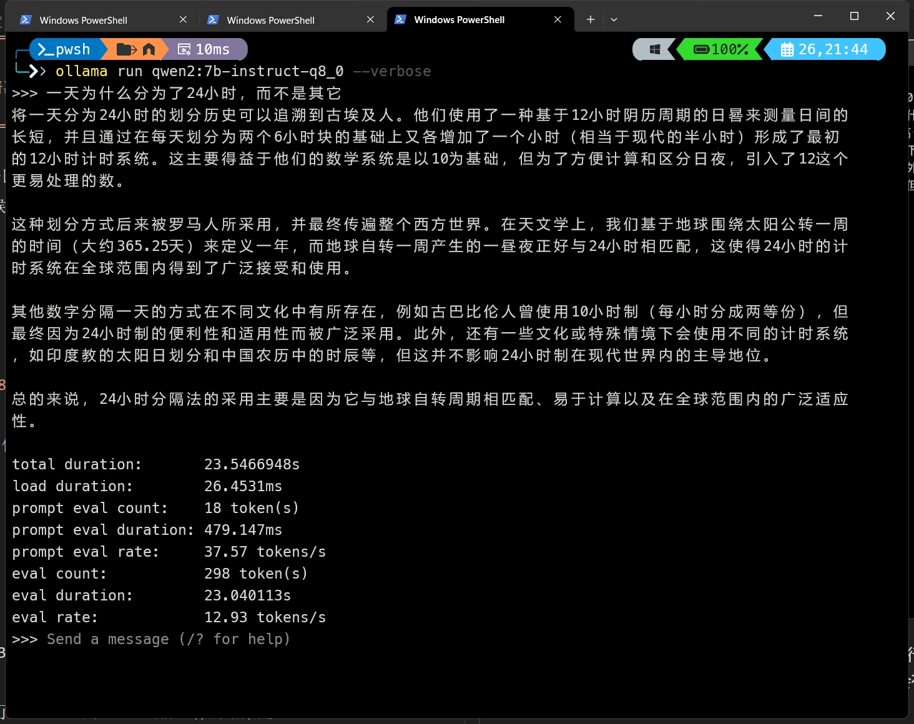

# 5.大模型执行速度

## CPU\GPU生成速度比较
对比示例如下   

</img>

- 左边是CPU执行
```shell
docker exec -it ollama-5 ollama run phi3:3.8b-mini-4k-instruct-q8_0 --verbose
```  
速度10.92 tokens/s

- 右边是GPU执行的
```shell
ollama run phi3:3.8b-mini-4k-instruct-q8_0 --verbose
```
速度48.96 tokens/s  

之所以选择phi3:3.8b-mini-4k-instruct-q8_0模型，因为对于CPU来说，再大的模型，执行的速度更慢。  
一般来说速度小于10 tokens/s的话，就会感觉卡顿；  

## 正确打开Ollama的方式
一般会单击下面的图标启动ollama  
</img>  
我以前也一直是这样用的，但是一个偶然的机会，发现使用
```shell
ollama serve #启动ollama服务端
```
速度会快一些。
还以“phi3:3.8b-mini-4k-instruct-q8_0”为例子
- 当使用exe启动时，执行情况如下：  
</img>  

- 当前使用serve方式启动时，执行情况如下：
</img>  

在我的电脑上，以serve执行的速度会比以exe方式执行快约 5 tokens/s 。  
当执行速度在30 tokens/s以上的时候，这种差距不会有什么感觉，但是当 0~20 tokens/s的时候，这种差距非常明显。

## 执行超出显存的模型
比如执行:
```shell
ollama run qwen2:7b-instruct-q8_0 --verbose
```
这个模型文件大小是8.1GB，执行后，使用命令
```shell
ollama ps
```
查看结果是：  
|NAME|ID|SIZE|PROCESSOR|
|--|--|--|--|
|qwen2:7b-instruct-q8_0|2f9a76350a1f|9.1 GB|20%/80% CPU/GPU|

使用了9.1GB的存储，其中20%分配到了CPU，80%的GPU。当前运行的结果是：
</img>  

速度才不到13 tokens/s