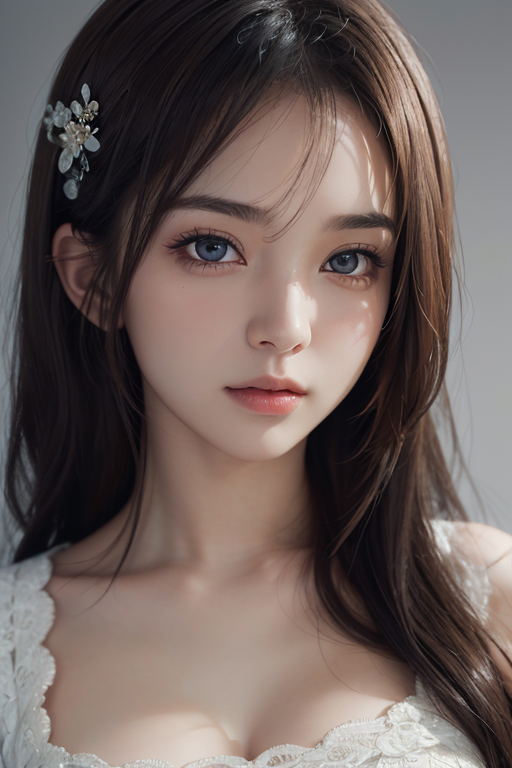
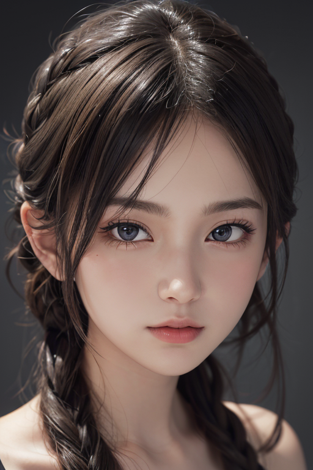
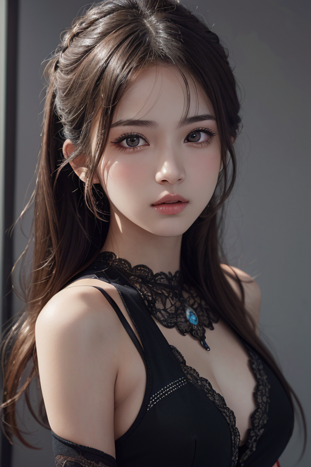
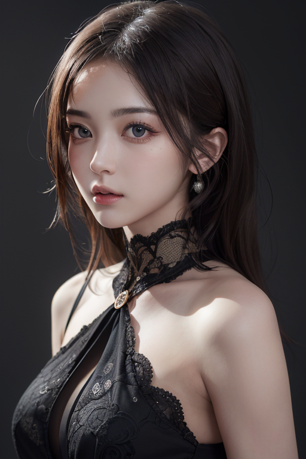
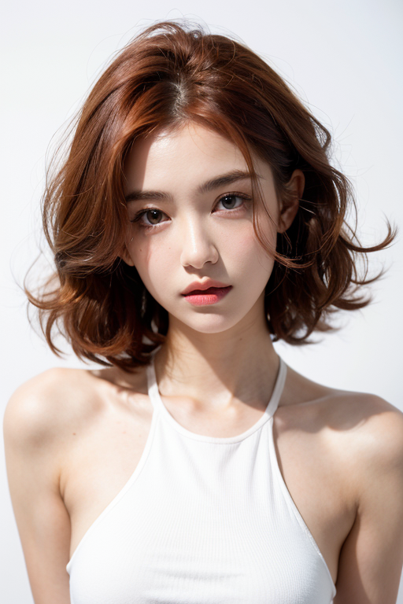
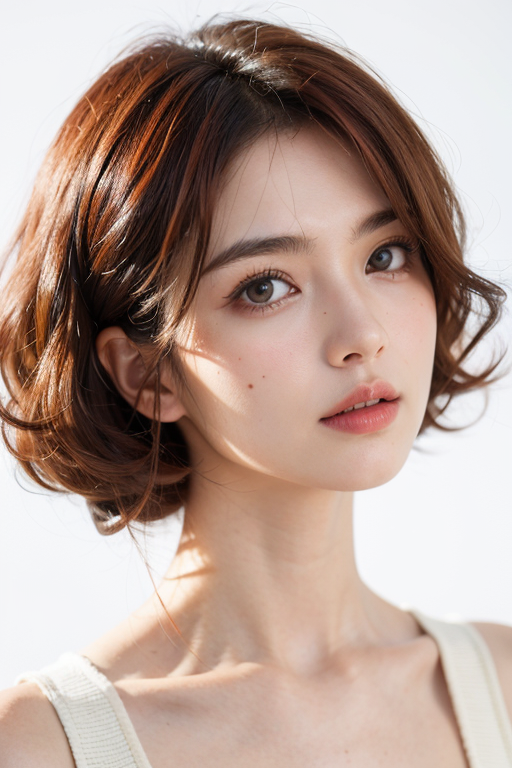
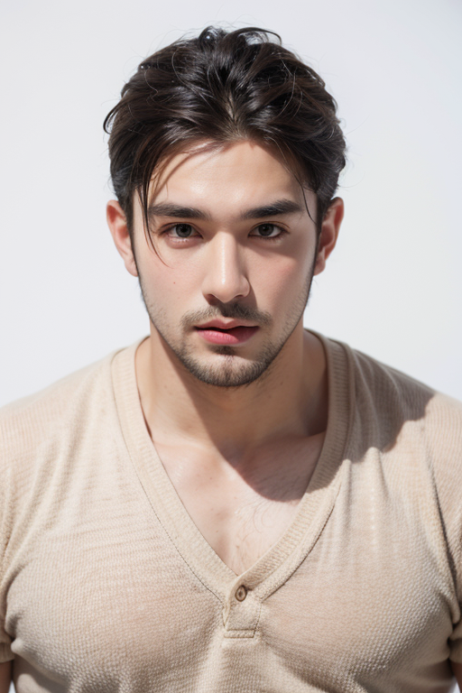
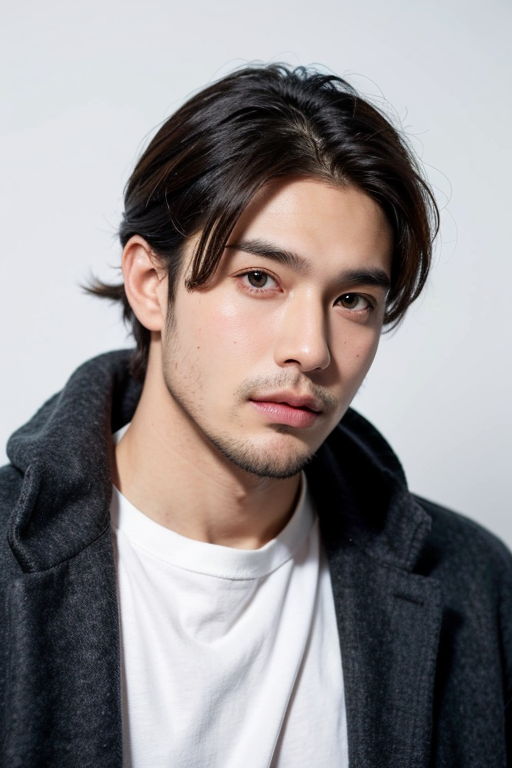

# AI关键词示例

## AI模型列表

|类型|地址|特点|图片示例|
|--|--|--|--|
|CHECKPOINT MERGE|[asian_brm(beautyrealmix)](https://civitai.com/models/367138/asianbrmbeautyrealmix)|写实、性感、泳衣、女人、女孩、性感女士|[示例](#asian_brm_beautyrealmix)|
|CHECKPOINT MERGE|[majicMIX realistic 麦橘写实](https://civitai.com/models/43331?modelVersionId=176425)|亚洲、写实、写真|[示例](#majicMIX_realistic)|
|lora|[Waist Slider (Microwaist) / 细腰](https://civitai.com/models/4602?modelVersionId=131413)|||
|lora|[Curly Hair Slider](https://civitai.com/models/133700/curly-hair-slider-lora)|头发，卷发，直发，光滑||
|lora|[Skin Tone Slider](https://civitai.com/models/112594?modelVersionId=121575)|白皮肤，黑皮肤，肤色，光滑||
|lora|[ShojoVibe少女感](https://civitai.com/models/13213?modelVersionId=16557)|动漫，3D，人物，写实，女性，肖像，逼真||

## <a name="asian_brm_beautyrealmix">asian_brm(beautyrealmix)</a>

## 示例1

- 咒语

    ```text
    1girl, upper body, (masterpiece, best quality), RAW photo, 16k wallpaper, extremely detailed CG, amazing, ultra detailed, hyperrealistic, official art, High quality texture, incredibly absurdres, highres, 18 years old, cute girl, beautiful face, detailed large black eyes,
    Negative prompt: EasyNegative, EasyNegativeV2, FastNegativeV2, ng_deepnegative_v1_75t, BadDream, bad_prompt_version2, bad-artist-anime, bad-artist, verybadimagenegative_v1.3, bad-hands-5, blurry, bad hands, extra legs, extra arms, extra fingers, missing fingers, text, error, lowres, low quality, monochrome, grayscale, signature, watermark, username, out of frame,
    Steps: 35, VAE: vae-ft-mse-840000-ema-pruned.ckpt, Size: 512x768, Seed: 3075667654, Model: asian_Brm_04.fp16, Version: v1.7.0, Sampler: DPM++ 2M Karras, CFG scale: 7, Clip skip: 2, Model hash: 1d43e3bdf0, Hires steps: 10, Hires upscale: 2, Hires upscaler: 4x-UltraSharp, Denoising strength: 0.3
    ```

- 图片展示  
  </img>
  </img>

## 示例2

- 咒语

  ```text
  1girl, upper body, (masterpiece, best quality), RAW photo, 16k wallpaper, extremely detailed CG, amazing, ultra detailed, hyperrealistic, official art, High quality texture, incredibly absurdres, highres, 18 years old, cute girl, beautiful face, detailed large black eyes,
  Negative prompt: EasyNegative, EasyNegativeV2, FastNegativeV2, ng_deepnegative_v1_75t, BadDream, bad_prompt_version2, bad-artist-anime, bad-artist, verybadimagenegative_v1.3, bad-hands-5, blurry, bad hands, extra legs, extra arms, extra fingers, missing fingers, text, error, lowres, low quality, monochrome, grayscale, signature, watermark, username, out of frame,
  Steps: 35, VAE: vae-ft-mse-840000-ema-pruned.ckpt, Size: 512x768, Seed: 2808469478, Model: asian_Brm_04.fp16, Version: v1.7.0, Sampler: DPM++ 2M Karras, CFG scale: 7, Clip skip: 2, Model hash: 1d43e3bdf0, Hires steps: 10, Hires upscale: 2, Hires upscaler: 4x-UltraSharp, Denoising strength: 0.3
  ```

- 图片展示  
  </img>
  </img>

## <a name="majicMIX_realistic">majicMIX realistic 麦橘写实</a>

- 示例1  

  ```text
  1girl,face,curly hair,red hair,white background,Negative prompt: (worst quality:2),(low quality:2),(normal quality:2),lowres,watermark,Steps: 20, VAE: vae-ft-mse-840000-ema-pruned.safetensors, Size: 512x768, Seed: 2287632957, Model: majicmix7, Version: v1.6.0, Sampler: Restart, VAE hash: 2453b80bc1, CFG scale: 7, Clip skip: 2, Model hash: 7c819b6d13, Hires steps: 20, BMAB contrast: 0.9, Hires upscale: 2, Hires upscaler: ESRGAN_4x, ADetailer model: face_yolov8n.pt, BMAB brightness: 1.1, ADetailer sampler: Euler a, ADetailer version: 23.9.3, Denoising strength: 0.1, ADetailer mask blur: 4, ADetailer confidence: 0.3, ADetailer dilate/erode: 4, BMAB color temperature: 15, BMAB noise alpha final: 0.05, ADetailer inpaint width: 512, ADetailer inpaint height: 512, ADetailer inpaint padding: 24, ADetailer denoising strength: 0.08, ADetailer inpaint only masked: True, ADetailer use separate sampler: True, ADetailer use inpaint width/height: True
  ```

- 图片展示  
  </img>
  </img>
- 示例2

  ```text
  1boy,handsome male,face,beard,white background,
  Negative prompt: (worst quality:2),(low quality:2),(normal quality:2),lowres,watermark,
  Steps: 20, VAE: vae-ft-mse-840000-ema-pruned.safetensors, Size: 512x768, Seed: 3550513535, Model: majicmix7, Version: v1.6.0, Sampler: Restart, VAE hash: 2453b80bc1, CFG scale: 7, Clip skip: 2, Model hash: 7c819b6d13, Hires steps: 20, BMAB contrast: 0.9, Hires upscale: 2, Hires upscaler: ESRGAN_4x, ADetailer model: face_yolov8n.pt, BMAB brightness: 1.1, ADetailer sampler: Euler a, ADetailer version: 23.9.3, Denoising strength: 0.1, ADetailer mask blur: 4, ADetailer confidence: 0.3, ADetailer dilate/erode: 4, BMAB color temperature: 15, BMAB noise alpha final: 0.05, ADetailer inpaint width: 512, ADetailer inpaint height: 512, ADetailer inpaint padding: 24, ADetailer denoising strength: 0.08, ADetailer inpaint only masked: True, ADetailer use separate sampler: True, ADetailer use inpaint width/height: True
  ```

- 图片展示  
  </img>
  </img>

- 示例3

```text
1girl,model pose,smirk,(topless:1.2),(nipples:1.2),navel,wide hip,curvy,gigantic breast,(ulzzang-6500:0.5),<lora:microwaistV05:0.5>,<lora:袁璟羽-09:0.3>,<lora:skin_tone_slider_v1:-0.5>,<lora:curly_hair_slider_v1:2.1>,<lora:shojovibe_v11:0.4>,
Negative prompt: (worst quality:2),(low quality:2),(normal quality:2),lowres,badhandv4,
Steps: 20, VAE: vae-ft-mse-840000-ema-pruned.safetensors, Size: 512x768, Seed: 2740381579, Model: majicmix_realistic_v7, Version: v1.6.0-2-g4afaaf8a, Sampler: Euler, VAE hash: 2453b80bc1, CFG scale: 7, Clip skip: 2, badhandv4: 5e40d722fc3d", Model hash: 7c819b6d13, Hires steps: 15, "ulzzang-6500: 66d481a222ee, BMAB contrast: 0.95, Hires upscale: 2, shojovibe_v11: 65ece304ac27", "microwaistV05: 471cf6f4fb0f, Hires upscaler: ESRGAN_4x, ADetailer model: face_yolov8s.pt, BMAB brightness: 1.1, BMAB sharpeness: 0.9, BMAB noise alpha: 0.05, ADetailer version: 23.11.1, Denoising strength: 0.1, ADetailer mask blur: 4, skin_tone_slider_v1: e6e222474f54, ADetailer confidence: 0.3, curly_hair_slider_v1: 8ce76d779754, 袁璟羽-09: 34e6516ae061, ADetailer dilate erode: 4, BMAB color temperature: 321, BMAB noise alpha final: 0.05, ADetailer inpaint width: 640, ADetailer inpaint height: 640, ADetailer inpaint padding: 32, ADetailer denoising strength: 0.1, ADetailer inpaint only masked: True, BMAB process_resize_by_person: 0.9, ADetailer mask only top k largest: 1, ADetailer use inpaint width height: True,   BMAB process_resize_by_person_ratio: 1.1
```

- 示例4

```text
1girl,evil smile,dramatic lighting,waist up,<lora:sharp_eyes:0.4>,<lora:microwaistV05:0.4>,fishnets,pantyhose,bare shoulders,no panties,(pussy:1.2),spreading legs,
Negative prompt: (badhandv4),(worst quality:2),(low quality:2),(normal quality:2),lowres,bad anatomy,normal quality,nsfw,
Steps: 20, Size: 512x768, Seed: 259807401, Model: majicmix_realistic_v7, Version: v1.6.0-2-g4afaaf8a, Sampler: Euler a, CFG mode: Half Cosine Up, CFG scale: 12, Clip skip: 2, "badhandv4: 5e40d722fc3d", Model hash: 7c819b6d13, "sharp_eyes: f8fede3ff9d5, Hires steps: 15, Mimic scale: 7, BMAB contrast: 0.95, Hires upscale: 2, microwaistV05: 471cf6f4fb0f", Hires upscaler: 8x_NMKD-Superscale_150000_G, ADetailer model: mediapipe_face_mesh, BMAB brightness: 1.05, BMAB sharpeness: 0.8, Interpolate Phi: 1, BMAB noise alpha: 0.05, ADetailer sampler: Euler a, ADetailer version: 23.11.1, CFG scale minimum: 4, Denoising strength: 0.1, Scaling Startpoint: MEAN, ADetailer CFG scale: 7.0, ADetailer mask blur: 4, Variability Measure: AD, ADetailer confidence: 0.3, Threshold percentile: 100, ADetailer dilate erode: 4, BMAB color temperature: -170, BMAB noise alpha final: 0.05, ADetailer inpaint width: 640, ADetailer inpaint height: 640, ADetailer inpaint padding: 28, Separate Feature Channels: False, ADetailer denoising strength: 0.14, Dynamic thresholding enabled: True, ADetailer inpaint only masked: True, ADetailer use separate sampler: True, ADetailer use separate CFG scale: True, ADetailer mask only top k largest: 1, ADetailer use inpaint width height: True
```
