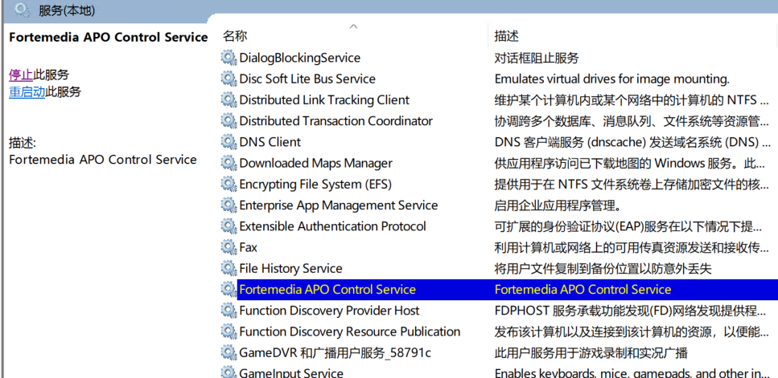

# 重装系统遇到的问题

## 标签
操作系统  重装 异常
## 问题背景
老婆的电脑，总是如下提醒：  

```text
此 Windows 内部版本即将过期
你的 Windows 内部版本将于 2024/9/15 过期。你应该尽快迁移到新的内部版本。请联机查看详细信息。
```
就是版本过老，于是我更新系统，总是在最后阶段失败；    
重新安装系统，也在最后阶段失败  


```text
0x80070002 0x20007在INSTALL DRIVERS 操作过程中的 SAFE OS 阶段，安装失败，出现错误
```
## 解决办法
>　　
> C：\$WINDOWS.~BT\Sources\Panther\setupact.log
>
>　　上面路径的log文件末尾中记录了具体错误，一般是system32\DriverStore\FileRepository目录某个硬件驱动不兼容导致，备份删除log文件结尾里提到的文件夹即可。
>
>　　可能需要先修改文件夹所有者和管理员完全控制才能删除。
>
其中setupact.log文件比较大，最下面是：  
```log
....
2024-10-06 01:12:07, Error                 DISM   DISM Driver Manager: PID=1984 TID=2008 Failed to import driver package 'C:\Windows\System32\DriverStore\FileRepository\fmservice.inf_amd64_8b510b07bfd18dc2\fmservice.inf'. - CDmiDriverStore::Import(hr:0x80070002)
2024-10-06 01:12:07, Error                 DISM   DISM Driver Manager: PID=1984 TID=2008 Failed to install the driver package 'C:\Windows\System32\DriverStore\FileRepository\fmservice.inf_amd64_8b510b07bfd18dc2\fmservice.inf'. - CDriverPackage::InternalInstall(hr:0x80070002)
2024-10-06 01:12:07, Error                 DISM   DISM Driver Manager: PID=1984 TID=2008 onecore\base\ntsetup\opktools\dism\providers\dmiprovider\dll\driverpackage.cpp:384 - CDriverPackage::InstallEx2(hr:0x80070002)
2024-10-06 01:12:07, Error                 DISM   API: PID=1708 TID=1980 Driver package C:\Windows\System32\DriverStore\FileRepository\fmservice.inf_amd64_8b510b07bfd18dc2\fmservice.inf failed to install. (hr:0x80070002) - CAddDriverCommandObject::AddDriverPackage(hr:0x80070002)
2024-10-06 01:12:07, Error                 DISM   API: PID=1708 TID=1980 onecore\base\ntsetup\opktools\dism\api\lib\dmicommandobjects.cpp:172 - CAddDriverCommandObject::InternalExecute(hr:0x80070002)
2024-10-06 01:12:07, Error                 DISM   API: PID=1708 TID=1980 InternalExecute failed - CBaseCommandObject::Execute(hr:0x80070002)
2024-10-06 01:12:07, Error                 DISM   API: PID=1708 TID=1712 CAddDriverCommandObject failed - DismAddDriverInternal(hr:0x80070002)
2024-10-06 01:12:07, Error                 SP         DRVMIG: Failed to inject driver package in the new OS: C:\Windows\System32\DriverStore\FileRepository\fmservice.inf_amd64_8b510b07bfd18dc2\fmservice.inf. Error: 0x80070002[gle=0x0000007a]
...
```
可以看出，是fmservice这个驱动的问题。找到fmservice.inf_amd64_8b510b07bfd18dc2目录，把它复制一份，备份起来，然后再把它删了。  
这里需要注意的是：删除此目录，需要管理员权限。在这个地方我发现，本地账号的权限竟然没有云端的账号权限大。

## fmservice这个驱动是什么？
通过查看此目录下的“FMService.inf”得知，此服务的名称是：Fortemedia APO Control Service  
  
在[file.net](https://www.file.net)中如下介绍：  
```text
FMService64.exe is an executable file that is part of the Fortemedia APO Control software. This software is developed by Fortemedia, a company known for its expertise in voice processing technology.

Fortemedia APO Control software is primarily used to enhance the audio performance of a computer. It provides advanced audio processing capabilities, such as noise suppression and echo cancellation, which can significantly improve the quality of audio in voice communication and multimedia applications.

If you frequently use voice communication or multimedia applications on your computer, the Fortemedia APO Control software can be very useful. It can help to ensure that the audio you hear and transmit is clear and free of background noise. The FMService64.exe file is a critical component of this software, and it is needed for the software to function correctly.

While the FMService64.exe file is generally safe and does not pose a threat to your computer, there are some circumstances in which you might want to remove it. For example, if you do not use the features provided by the Fortemedia APO Control software, or if the software is causing problems with your computer, you might choose to uninstall it. If the FMService64.exe file is located outside of the C:\Users\USERNAME\AppData\Roaming directory, it could be a sign of a malicious program, and you should consider removing it.
```
此软件“...主要用于增强计算机的音频性能。它提供了高级音频处理功能，例如噪音抑制和回声消除，这些功能可以显著提高语音通信和多媒体应用程序中的音频质量。” 正常来说，这是一个正常的软件，但是不知道为什么会造成更新失败的问题。

## 参考资料
- [系统安装失败提示“0x80070002-0x20007”的解决方法](https://www.win10d.com/jiaocheng/30062.html)
  - 此连接提供的第二个方法即时本答案所使用的方法
- [更新失败，“在INSTALL_DRIVERS操作过程中，显示错误代码0x80070002-0x20007,SAFE_OS阶段安装失败”](https://answers.microsoft.com/zh-hans/insider/forum/all/%E6%9B%B4%E6%96%B0%E5%A4%B1%E8%B4%A5%E5%9C%A8insta/52091ca0-1d4d-4c70-a576-f25ca2f7346c)
  - 此连接提供的方法无效
- [What is fmservice64.exe?](https://www.file.net/process/fmservice64.exe.html)